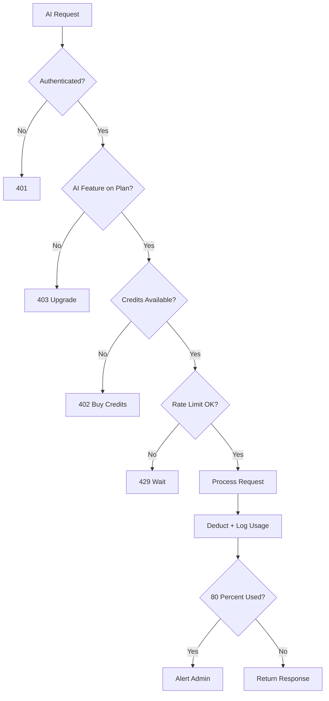

# Examind Backend - Implementation Plan Part 2
# Phases 8 (continued), 9-14: Infrastructure, Security, Performance, Testing

---

## Phase 8: Communications App (continued)

### Remaining Models

```python
# ThreadParticipant
- id: UUIDField (PK)
- thread: ForeignKey(MessageThread)
- user: ForeignKey(User)
- role: CharField [member, admin]
- joined_at: DateTimeField(auto_now_add)
- last_read_at: DateTimeField(null)
- is_muted: BooleanField(default=False)

# Message
- id: UUIDField (PK)
- thread: ForeignKey(MessageThread)
- sender: ForeignKey(User)
- content: TextField
- attachment: FileField(null)
- is_edited: BooleanField(default=False)
- edited_at: DateTimeField(null)
- created_at: DateTimeField(auto_now_add)
```

### API Endpoints

| Method | Endpoint | Description |
|--------|----------|-------------|
| GET/POST | `/api/v1/communications/announcements/` | List/create announcements |
| GET/PUT/DELETE | `/api/v1/communications/announcements/<id>/` | Announcement detail |
| GET/POST | `/api/v1/communications/threads/` | List/create message threads |
| GET | `/api/v1/communications/threads/<id>/` | Thread detail with messages |
| POST | `/api/v1/communications/threads/<id>/messages/` | Send message |
| POST | `/api/v1/communications/threads/<id>/read/` | Mark thread as read |

---

## Phase 9: Database Relationships and Indexes

### Critical Multi-Tenancy Relationships

Every model that stores school-specific data MUST have a `school` ForeignKey. Enforced via:

1. **Model-level**: `school = models.ForeignKey(School, on_delete=models.CASCADE, db_index=True)`
2. **Manager-level**: Custom manager that auto-filters by school
3. **Middleware-level**: Already implemented via `SchoolContextMiddleware`

### Custom Manager Pattern

```python
class SchoolScopedManager(models.Manager):
    def for_school(self, school):
        return self.filter(school=school)
    
    def get_queryset(self):
        return super().get_queryset().select_related('school')
```

### Database Indexes to Add

| Model | Index Fields | Purpose |
|-------|-------------|---------|
| Enrollment | [student, term, status] | Student schedule lookup |
| ExamAttempt | [exam, student, status] | Check existing attempts |
| ExamAttempt | [school, submitted_at] | School-level reporting |
| Result | [student, term] | Transcript generation |
| Result | [school, subject, term] | Subject analytics |
| Material | [school, subject, is_published] | Material listing |
| MaterialProgress | [student, completed] | Student progress dashboard |
| Notification | [recipient, is_read, created_at] | Unread notifications |
| Payment | [school, status, created_at] | Payment history |
| AIUsageRecord | [school, created_at] | Usage reporting |
| LoginAttempt | [email, attempted_at] | Rate limiting queries |
| Question | [exam, order] | Question ordering |
| TimetableSlot | [timetable, day_of_week] | Daily schedule |

### Many-to-Many Through Tables

```python
# ClassSubject - Which subjects are taught in which classes
class ClassSubject(models.Model):
    classroom = ForeignKey(ClassRoom)
    subject = ForeignKey(Subject)
    term = ForeignKey(Term)
    class Meta:
        unique_together = ['classroom', 'subject', 'term']

# ExamClassAssignment - Which classes take which exams
class ExamClassAssignment(models.Model):
    exam = ForeignKey(Exam)
    classroom = ForeignKey(ClassRoom)
    assigned_at = DateTimeField(auto_now_add)
    class Meta:
        unique_together = ['exam', 'classroom']
```

### Self-Referential Relationships

| Model | Field | Purpose |
|-------|-------|---------|
| Topic | `parent_topic = ForeignKey self null blank` | Hierarchical topics |
| Department | `parent_department = ForeignKey self null blank` | Department hierarchy |
| MaterialComment | `parent = ForeignKey self null blank` | Threaded comments |

---

## Phase 10: Security Hardening

### 10.1 Rate Limiting

**Package:** `django-ratelimit`

```python
# Tiered rate limits by plan:
# Free: 100 requests/minute
# Basic: 300 requests/minute
# Standard: 600 requests/minute
# Premium: 1200 requests/minute
# Enterprise: 3000 requests/minute

# Login endpoint: 5 attempts per 15 minutes per IP
# AI endpoints: Per-school daily limits based on credits
# File upload: 10 uploads/minute per user

# Redis-based sliding window algorithm
# Key pattern: ratelimit:{school_id}:{endpoint}:{window}
```

### 10.2 Account Lockout Enhancement

```python
# Current: 5 failed attempts in 15 min blocks login (already implemented)
# Add:
# - After 10 failed attempts in 1 hour: lock for 1 hour + email notification
# - After 25 failed attempts in 24 hours: lock until admin unlock + alert platform admin
# - New fields on User: locked_until, lock_reason
```

### 10.3 Two-Factor Authentication

**Package:** `django-otp` + `qrcode`

```python
# New models in accounts app:
class TOTPDevice(models.Model):
    user = OneToOneField(User)
    secret_key = CharField(max_length=32)  # Encrypted
    is_confirmed = BooleanField(default=False)
    created_at = DateTimeField(auto_now_add)

class BackupCode(models.Model):
    user = ForeignKey(User)
    code = CharField(max_length=10)  # Hashed
    is_used = BooleanField(default=False)
    used_at = DateTimeField(null=True)

# Rules:
# - Optional for students/teachers/parents
# - Required for school_admin and platform_admin roles
# - TOTP-based: Google Authenticator, Authy compatible
# - 10 backup codes generated on setup

# New endpoints:
# POST /api/v1/auth/2fa/setup/
# POST /api/v1/auth/2fa/verify/
# POST /api/v1/auth/2fa/disable/
# POST /api/v1/auth/2fa/backup-codes/
```

### 10.4 Field-Level Encryption

**Package:** `django-encrypted-model-fields`

Fields to encrypt:
- `User.phone`
- `School.phone`
- `Payment.gateway_response`
- `WebhookEvent.payload`
- `TOTPDevice.secret_key`

### 10.5 File Upload Security

```python
ALLOWED_FILE_TYPES = {
    'document': ['.pdf', '.doc', '.docx', '.ppt', '.pptx', '.xls', '.xlsx', '.txt'],
    'video': ['.mp4', '.webm', '.avi', '.mov'],
    'audio': ['.mp3', '.wav', '.ogg', '.m4a'],
    'image': ['.jpg', '.jpeg', '.png', '.gif', '.webp'],
    'scorm': ['.zip'],
}

FILE_SIZE_LIMITS = {
    'free': 5 * 1024 * 1024,        # 5MB
    'basic': 25 * 1024 * 1024,       # 25MB
    'standard': 50 * 1024 * 1024,    # 50MB
    'premium': 100 * 1024 * 1024,    # 100MB
    'enterprise': 500 * 1024 * 1024, # 500MB
}

# Validation steps:
# 1. Check file extension against whitelist
# 2. Verify MIME type matches extension
# 3. Check file size against plan limit
# 4. Strip EXIF data from images
# 5. Validate SCORM manifest.xml
# 6. Serve files through signed URLs with 1-hour expiry
```

### 10.6 Webhook Security

```python
# Paystack:
# 1. Verify X-Paystack-Signature via HMAC SHA512
# 2. Whitelist Paystack IP ranges
# 3. Idempotency check via WebhookEvent model
# 4. Process async via Celery
# 5. Return 200 immediately

# Flutterwave:
# 1. Verify verif-hash header
# 2. Confirm transaction via API call
# 3. Same idempotency and async processing
```

### 10.7 Request ID Tracking

```python
# New middleware: RequestIDMiddleware
# - Generates UUID for every request
# - Attaches to response: X-Request-ID header
# - Included in all log entries
# - Passed to Celery tasks for tracing
```

---

## Phase 11: Performance Optimizations

### 11.1 Query Optimization Mixin

```python
class SchoolQuerysetMixin:
    school_field = 'school'
    select_related_fields = []
    prefetch_related_fields = []
    
    def get_queryset(self):
        qs = super().get_queryset()
        if hasattr(self.request, 'school') and self.request.school:
            qs = qs.filter(**{self.school_field: self.request.school})
        if self.select_related_fields:
            qs = qs.select_related(*self.select_related_fields)
        if self.prefetch_related_fields:
            qs = qs.prefetch_related(*self.prefetch_related_fields)
        return qs
```

### 11.2 Caching Strategy

```python
# Redis cache key patterns:
# school:{id}:settings          TTL: 1 hour
# school:{id}:plan_features     TTL: 1 hour
# school:{id}:student_count     TTL: 5 min
# user:{id}:permissions         TTL: 5 min
# subject:{id}:topics           TTL: 10 min
# exam:{id}:questions           TTL: exam duration
# analytics:school:{id}:dash    TTL: 5 min
# user:{id}:unread_count        TTL: 1 min

# Invalidation via Django signals on post_save/post_delete
```

### 11.3 Celery Task Architecture

```python
# Task queues:
# default       - General tasks
# ai            - AI/LLM tasks (separate worker, higher memory)
# notifications - Email/push sending
# analytics     - Background calculations
# payments      - Payment processing and webhooks

# Periodic tasks via celery-beat:
# - Reset AI credits monthly: 1st of month, 00:00
# - Calculate analytics: daily at 02:00
# - Check expiring subscriptions: daily at 06:00
# - Clean expired sessions: daily at 03:00
# - Generate invoices: monthly on 1st
# - Archive old data: weekly on Sunday
# - Check storage quotas: daily at 05:00
```

### 11.4 Database Connection Pooling

```python
# Use django-db-connection-pool or external PgBouncer
# Pool size: 10 connections per worker
# Max overflow: 20
# Connection recycle: 300 seconds
```

### 11.5 Pagination Strategy

```python
# StandardPagination (page_size=20): subjects, materials, classrooms
# CursorPagination (page_size=50): notifications, exam attempts, results, messages
# No pagination: dropdown data (plan list, department list)
```

### 11.6 Response Optimization

```python
# 1. GZip middleware for compression
# 2. Sparse fieldsets: ?fields=id,name,code
# 3. Conditional responses via ETag/Last-Modified
# 4. Bulk operations: bulk_create for notifications, bulk_update for progress
```

---

## Phase 12: Monetization Enhancements

### AI Cost Control Flow



### AI Service Layer

```python
# core/ai_service.py - Centralized AI with cost control
# - check_credits() before every AI call
# - consume_and_log() after successful call
# - estimate_cost() based on token usage and model
# - check_quota_alert() at 80% usage
```

### Revenue Tracking

```python
# RevenueSnapshot model in analytics app
# Calculated daily via Celery task
# Tracks: MRR, ARR, churn rate, new subs, upgrades, downgrades
# Platform admin dashboard data source
```

### Coupon System

```python
# Validation flow:
# 1. Check coupon exists and is active
# 2. Check not expired (valid_from <= now <= valid_until)
# 3. Check max_redemptions not reached
# 4. Check school hasn't already used it (unique_together)
# 5. Check applicable to selected plan
# 6. Calculate discount (percentage or fixed)
# 7. Apply to payment amount
# 8. Create CouponRedemption record
```

---

## Phase 13: Testing Strategy

### Test Structure per App

```
app_name/tests/
    __init__.py
    test_models.py
    test_serializers.py
    test_views.py
    test_permissions.py
    test_tasks.py
    test_services.py
    factories.py
```

### Key Test Scenarios

| Category | Tests |
|----------|-------|
| Multi-tenancy | School A cannot access School B data |
| Permissions | Role-based access control for all endpoints |
| Subscription gating | Feature checks per plan level |
| Rate limiting | Login throttling, API rate limits |
| Payment flow | Initialize, webhook, activation, refund |
| Exam flow | Create, publish, attempt, submit, grade |
| AI credits | Consume, block at zero, monthly reset |
| Data integrity | Cascade deletes, unique constraints |

### Test Configuration

```python
# pytest.ini
[pytest]
DJANGO_SETTINGS_MODULE = config.settings_test
addopts = --reuse-db --nomigrations -v --cov=. --cov-report=html

# config/settings_test.py
# SQLite in-memory for speed
# LocMem cache
# CELERY_TASK_ALWAYS_EAGER = True
# Console email backend
```

---

## Phase 14: Migration and Deployment Strategy

### Migration Order

| Order | App | Depends On |
|-------|-----|-----------|
| 1 | accounts | - |
| 2 | schools | - |
| 3 | subscriptions | schools |
| 4 | subjects | schools, accounts |
| 5 | exams | subjects, schools, accounts |
| 6 | materials | subjects, schools, accounts |
| 7 | notifications | accounts, schools |
| 8 | payments | subscriptions, schools, accounts |
| 9 | analytics | exams, subjects, materials, schools |
| 10 | communications | accounts, schools |

### New Dependencies

```
# Security
django-otp==1.5.0
qrcode==8.0
django-encrypted-model-fields==0.6.5
python-magic==0.4.27

# Performance
django-db-connection-pool==1.2.5

# Testing
pytest==8.3.0
pytest-django==4.9.0
pytest-cov==6.0.0
factory-boy==3.3.0
faker==30.0.0

# Payments
requests==2.32.0

# File handling
boto3==1.35.0
django-storages==1.14.0

# API docs
drf-spectacular==0.28.0

# Rate limiting
django-ratelimit==4.1.0

# Monitoring
sentry-sdk==2.14.0
```

### Updated INSTALLED_APPS

```python
THIRD_PARTY_APPS = [
    'rest_framework',
    'rest_framework_simplejwt',
    'rest_framework_simplejwt.token_blacklist',
    'corsheaders',
    'django_filters',
    'drf_spectacular',
    'django_otp',
    'django_otp.plugins.otp_totp',
]

LOCAL_APPS = [
    'core',              # NEW - shared utilities
    'accounts',
    'schools',
    'subscriptions',
    'subjects',          # NEW
    'exams',             # NEW
    'materials',         # NEW
    'notifications',     # NEW
    'payments',          # NEW
    'analytics',         # NEW
    'communications',    # NEW
]
```

### Updated URL Configuration

```python
urlpatterns = [
    path('admin/', admin.site.urls),
    path('api/v1/auth/', include('accounts.urls')),
    path('api/v1/schools/', include('schools.urls')),
    path('api/v1/subscriptions/', include('subscriptions.urls')),
    path('api/v1/subjects/', include('subjects.urls')),
    path('api/v1/exams/', include('exams.urls')),
    path('api/v1/materials/', include('materials.urls')),
    path('api/v1/notifications/', include('notifications.urls')),
    path('api/v1/payments/', include('payments.urls')),
    path('api/v1/analytics/', include('analytics.urls')),
    path('api/v1/communications/', include('communications.urls')),
    path('webhooks/', include('payments.webhook_urls')),
    # API documentation
    path('api/schema/', SpectacularAPIView.as_view(), name='schema'),
    path('api/docs/', SpectacularSwaggerView.as_view(), name='swagger-ui'),
]
```

### File Structure for Each New App

```
app_name/
    __init__.py
    admin.py
    apps.py
    models.py
    serializers.py
    views.py
    urls.py
    permissions.py
    signals.py
    tasks.py          # Celery tasks
    services.py       # Business logic
    managers.py       # Custom model managers
    filters.py        # DRF filter classes
    migrations/
        __init__.py
    tests/
        __init__.py
        test_models.py
        test_views.py
        factories.py
```

---

## Execution Order Summary

| Priority | Phase | What | Why First |
|----------|-------|------|-----------|
| 1 | Phase 1 | Missing models in existing apps | Foundation for everything else |
| 2 | Phase 2 | Subjects app | Core academic feature, dependency for exams/materials |
| 3 | Phase 6 | Payments app | Revenue-critical, needed for subscriptions to work |
| 4 | Phase 3 | Exams app | Core product feature, highest user value |
| 5 | Phase 4 | Materials app | Second core academic feature |
| 6 | Phase 5 | Notifications app | User engagement, needed by other features |
| 7 | Phase 10 | Security hardening | Must be done before production |
| 8 | Phase 8 | Communications app | Nice-to-have, lower priority |
| 9 | Phase 7 | Analytics app | Depends on exam/material data existing |
| 10 | Phase 11 | Performance optimization | Optimize after features work |
| 11 | Phase 12 | Monetization extras | Revenue optimization |
| 12 | Phase 9 | Indexes and relationships | Final DB tuning |
| 13 | Phase 13 | Tests | Validate everything |
| 14 | Phase 14 | Migrations and deploy | Ship it |

---

## Design Principles

1. **All models use UUID primary keys** - Non-sequential for security
2. **All timestamps use auto_now_add/auto_now** - Consistency
3. **All school-scoped models include school FK with db_index=True** - Multi-tenancy
4. **Soft deletes preferred** - Audit trail via is_active/is_deleted fields
5. **JSONField used sparingly** - Only for truly dynamic/unstructured data
6. **Business logic in services.py** - Keep views thin
7. **Async for heavy operations** - Celery tasks for AI, PDF, email, analytics
8. **Cache aggressively, invalidate precisely** - Redis + signals
9. **API responses follow consistent format** - Always include status codes and messages
10. **Every endpoint has permission checks** - Never rely on obscurity
