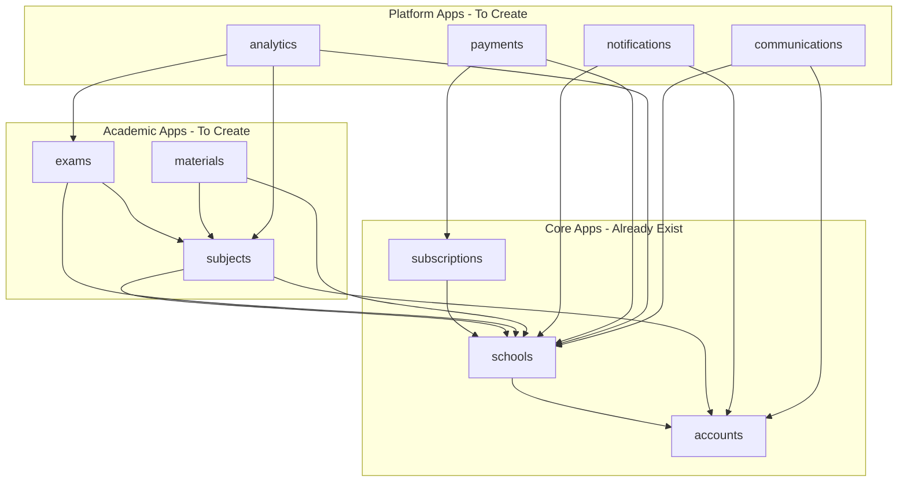

# Examind Backend - Full Implementation Plan

## Project Overview

**Project Path:** `C:/Users/HomePC/Desktop/edu_portal`  
**Framework:** Django 6.0.6 + Django REST Framework 3.17.1  
**Database:** PostgreSQL (via psycopg2-binary)  
**Cache/Broker:** Redis  
**Task Queue:** Celery  
**Auth:** JWT (SimpleJWT with token blacklist)  

---

## Current State Assessment

### Existing Apps & Models

| App | Models Implemented | Status |
|-----|-------------------|--------|
| `accounts` | User, Profile, UserSession, LoginAttempt | Partial - missing EmailVerificationToken, PasswordResetToken |
| `schools` | School, SchoolMembership, SchoolSettings, AcademicYear, Term, Department, ClassRoom | Mostly complete - missing StorageUsage |
| `subscriptions` | Plan, PlanFeature, Subscription, SubscriptionHistory, AICredit, AddOn, SchoolAddOn | Partial - missing PlanChangeRequest, UsageRecord, TrialExtension, Referral |

### Apps NOT Yet Created

| App | Priority | Purpose |
|-----|----------|---------|
| `subjects` | HIGH | Subject management, enrollment, timetabling |
| `exams` | HIGH | Exam creation, questions, attempts, grading |
| `materials` | MEDIUM | Learning materials, SCORM, progress tracking |
| `notifications` | MEDIUM | Push/email/in-app notifications |
| `payments` | HIGH | Payment processing, invoices, refunds |
| `analytics` | LOW | Performance metrics, learning paths |
| `communications` | LOW | Messaging, announcements |

---

## Architecture Diagram



---

## Phase 1: Add Missing Models to Existing Apps

### 1.1 accounts app - New Models

```python
# EmailVerificationToken
- id: UUIDField (PK)
- user: ForeignKey(User)
- token: CharField(max_length=64, unique, indexed)
- created_at: DateTimeField(auto_now_add)
- expires_at: DateTimeField
- is_used: BooleanField(default=False)

# PasswordResetToken
- id: UUIDField (PK)
- user: ForeignKey(User)
- token: CharField(max_length=64, unique, indexed)
- created_at: DateTimeField(auto_now_add)
- expires_at: DateTimeField
- is_used: BooleanField(default=False)
- ip_address: GenericIPAddressField
```

### 1.2 schools app - New Models

```python
# StorageUsage
- id: UUIDField (PK)
- school: OneToOneField(School)
- used_bytes: BigIntegerField(default=0)
- file_count: IntegerField(default=0)
- last_calculated_at: DateTimeField
```

### 1.3 subscriptions app - New Models

```python
# PlanChangeRequest
- id: UUIDField (PK)
- subscription: ForeignKey(Subscription)
- from_plan: ForeignKey(Plan)
- to_plan: ForeignKey(Plan)
- status: CharField [pending, approved, rejected, completed]
- scheduled_date: DateTimeField
- completed_at: DateTimeField(null)
- created_at: DateTimeField(auto_now_add)

# UsageRecord
- id: UUIDField (PK)
- school: ForeignKey(School)
- feature_key: CharField(max_length=50, indexed)
- usage_count: IntegerField(default=0)
- period_start: DateField
- period_end: DateField
- created_at: DateTimeField(auto_now_add)

# TrialExtension
- id: UUIDField (PK)
- subscription: ForeignKey(Subscription)
- extended_days: IntegerField
- reason: TextField
- granted_by: ForeignKey(User)
- created_at: DateTimeField(auto_now_add)

# Referral
- id: UUIDField (PK)
- referrer_school: ForeignKey(School, related_name=referrals_made)
- referred_school: ForeignKey(School, related_name=referred_by, null)
- referral_code: CharField(max_length=20, unique)
- status: CharField [pending, completed, expired]
- created_at: DateTimeField(auto_now_add)
- completed_at: DateTimeField(null)

# ReferralReward
- id: UUIDField (PK)
- referral: OneToOneField(Referral)
- reward_type: CharField [credit, discount, extension]
- reward_value: IntegerField
- is_claimed: BooleanField(default=False)
- claimed_at: DateTimeField(null)
```

---

## Phase 2: Create `subjects` App

### Models

```python
# Subject
- id: UUIDField (PK)
- school: ForeignKey(School) # CRITICAL for multi-tenancy
- name: CharField(max_length=200)
- code: CharField(max_length=20)
- description: TextField(blank)
- department: ForeignKey(Department, null)
- credit_units: IntegerField(default=1)
- is_elective: BooleanField(default=False)
- is_active: BooleanField(default=True)
- created_at: DateTimeField(auto_now_add)
- Unique together: [school, code]

# Topic
- id: UUIDField (PK)
- subject: ForeignKey(Subject)
- parent_topic: ForeignKey(self, null) # Self-referential for hierarchy
- name: CharField(max_length=200)
- description: TextField(blank)
- order: IntegerField
- is_active: BooleanField(default=True)

# SubjectTeacherAssignment
- id: UUIDField (PK)
- subject: ForeignKey(Subject)
- teacher: ForeignKey(User)
- classroom: ForeignKey(ClassRoom)
- term: ForeignKey(Term)
- is_primary: BooleanField(default=True)
- assigned_at: DateTimeField(auto_now_add)
- Unique together: [subject, teacher, classroom, term]

# Enrollment
- id: UUIDField (PK)
- student: ForeignKey(User)
- subject: ForeignKey(Subject)
- classroom: ForeignKey(ClassRoom)
- term: ForeignKey(Term)
- enrolled_at: DateTimeField(auto_now_add)
- status: CharField [active, dropped, completed]
- Unique together: [student, subject, term]

# Prerequisite
- id: UUIDField (PK)
- subject: ForeignKey(Subject, related_name=prerequisites)
- required_subject: ForeignKey(Subject, related_name=prerequisite_for)
- minimum_grade: CharField(max_length=5, null)

# Timetable
- id: UUIDField (PK)
- school: ForeignKey(School)
- term: ForeignKey(Term)
- name: CharField(max_length=100)
- is_active: BooleanField(default=True)

# TimetableSlot
- id: UUIDField (PK)
- timetable: ForeignKey(Timetable)
- subject: ForeignKey(Subject)
- classroom: ForeignKey(ClassRoom)
- teacher: ForeignKey(User)
- day_of_week: IntegerField [0-6]
- start_time: TimeField
- end_time: TimeField
- room_name: CharField(max_length=50, blank)
```

### API Endpoints

| Method | Endpoint | Description |
|--------|----------|-------------|
| GET/POST | `/api/v1/subjects/` | List/create subjects |
| GET/PUT/DELETE | `/api/v1/subjects/<id>/` | Subject detail |
| GET/POST | `/api/v1/subjects/<id>/topics/` | List/create topics |
| GET/POST | `/api/v1/subjects/<id>/enroll/` | Enroll student |
| GET | `/api/v1/subjects/<id>/students/` | List enrolled students |
| GET/POST | `/api/v1/subjects/<id>/teachers/` | Assign teachers |
| GET/POST | `/api/v1/timetables/` | List/create timetables |
| GET/POST | `/api/v1/timetables/<id>/slots/` | Manage slots |

---

## Phase 3: Create `exams` App

### Models

```python
# Exam
- id: UUIDField (PK)
- school: ForeignKey(School) # CRITICAL for multi-tenancy
- subject: ForeignKey(Subject)
- term: ForeignKey(Term)
- classroom: ForeignKey(ClassRoom, null) # Which class takes this exam
- title: CharField(max_length=200)
- description: TextField(blank)
- exam_type: CharField [quiz, test, midterm, final, assignment]
- total_marks: DecimalField
- pass_marks: DecimalField
- duration_minutes: IntegerField
- start_time: DateTimeField(null)
- end_time: DateTimeField(null)
- is_published: BooleanField(default=False)
- is_proctored: BooleanField(default=False)
- shuffle_questions: BooleanField(default=False)
- show_results_immediately: BooleanField(default=True)
- max_attempts: IntegerField(default=1)
- created_by: ForeignKey(User)
- created_at: DateTimeField(auto_now_add)

# QuestionBank
- id: UUIDField (PK)
- school: ForeignKey(School)
- subject: ForeignKey(Subject)
- name: CharField(max_length=200)
- description: TextField(blank)
- created_by: ForeignKey(User)
- created_at: DateTimeField(auto_now_add)

# QuestionTag
- id: UUIDField (PK)
- school: ForeignKey(School)
- name: CharField(max_length=50)
- tag_type: CharField [difficulty, bloom_taxonomy, topic, custom]

# Question
- id: UUIDField (PK)
- exam: ForeignKey(Exam, null, blank) # Can be standalone in bank
- question_bank: ForeignKey(QuestionBank, null, blank)
- question_type: CharField [mcq, true_false, short_answer, essay, fill_blank]
- text: TextField
- explanation: TextField(blank)
- marks: DecimalField
- order: IntegerField
- is_required: BooleanField(default=True)
- tags: ManyToManyField(QuestionTag, blank)
- metadata: JSONField(default=dict) # AI generation metadata
- created_at: DateTimeField(auto_now_add)

# QuestionOption
- id: UUIDField (PK)
- question: ForeignKey(Question)
- text: TextField
- is_correct: BooleanField(default=False)
- order: IntegerField

# ExamTemplate
- id: UUIDField (PK)
- school: ForeignKey(School)
- name: CharField(max_length=200)
- subject: ForeignKey(Subject, null)
- structure: JSONField # {sections: [{name, question_count, marks_per_question, type}]}
- created_by: ForeignKey(User)
- created_at: DateTimeField(auto_now_add)

# ExamGroup
- id: UUIDField (PK)
- school: ForeignKey(School)
- name: CharField(max_length=200)
- term: ForeignKey(Term)
- exams: ManyToManyField(Exam)
- created_at: DateTimeField(auto_now_add)

# ExamAttempt
- id: UUIDField (PK)
- exam: ForeignKey(Exam)
- student: ForeignKey(User)
- school: ForeignKey(School) # Denormalized for queries
- attempt_number: IntegerField(default=1)
- started_at: DateTimeField(auto_now_add)
- submitted_at: DateTimeField(null)
- score: DecimalField(null)
- percentage: DecimalField(null)
- status: CharField [in_progress, submitted, graded, timed_out]
- ip_address: GenericIPAddressField(null)
- proctoring_data: JSONField(default=dict)

# Answer
- id: UUIDField (PK)
- attempt: ForeignKey(ExamAttempt)
- question: ForeignKey(Question)
- selected_option: ForeignKey(QuestionOption, null)
- text_answer: TextField(blank)
- marks_awarded: DecimalField(null)
- is_correct: BooleanField(null)
- graded_by: ForeignKey(User, null)
- graded_at: DateTimeField(null)
- ai_feedback: TextField(blank)

# Result
- id: UUIDField (PK)
- school: ForeignKey(School) # CRITICAL for multi-tenancy
- student: ForeignKey(User)
- subject: ForeignKey(Subject)
- term: ForeignKey(Term)
- exam: ForeignKey(Exam, null)
- score: DecimalField
- grade: CharField(max_length=5)
- remarks: TextField(blank)
- published_at: DateTimeField(null)
- created_at: DateTimeField(auto_now_add)
```

### API Endpoints

| Method | Endpoint | Description |
|--------|----------|-------------|
| GET/POST | `/api/v1/exams/` | List/create exams |
| GET/PUT/DELETE | `/api/v1/exams/<id>/` | Exam detail |
| GET/POST | `/api/v1/exams/<id>/questions/` | Manage questions |
| POST | `/api/v1/exams/<id>/publish/` | Publish exam |
| POST | `/api/v1/exams/<id>/start/` | Start attempt |
| POST | `/api/v1/exams/<id>/submit/` | Submit attempt |
| GET | `/api/v1/exams/<id>/results/` | View results |
| GET/POST | `/api/v1/question-banks/` | Question banks |
| POST | `/api/v1/exams/<id>/generate-questions/` | AI question generation |
| GET | `/api/v1/results/` | Student results |
| GET | `/api/v1/results/transcript/` | Generate transcript |

---

## Phase 4: Create `materials` App

### Models

```python
# Material
- id: UUIDField (PK)
- school: ForeignKey(School) # CRITICAL for multi-tenancy
- subject: ForeignKey(Subject)
- topic: ForeignKey(Topic, null)
- term: ForeignKey(Term, null)
- title: CharField(max_length=200)
- description: TextField(blank)
- material_type: CharField [document, video, audio, link, scorm, interactive]
- file: FileField(upload_to=materials/, null)
- file_url: URLField(blank) # External link
- file_size_bytes: BigIntegerField(default=0)
- duration_seconds: IntegerField(null) # For video/audio
- is_published: BooleanField(default=False)
- order: IntegerField(default=0)
- uploaded_by: ForeignKey(User)
- created_at: DateTimeField(auto_now_add)

# MaterialProgress
- id: UUIDField (PK)
- student: ForeignKey(User)
- material: ForeignKey(Material)
- progress_percent: IntegerField(default=0)
- last_position: IntegerField(default=0) # For video/audio
- completed: BooleanField(default=False)
- completed_at: DateTimeField(null)
- time_spent_seconds: IntegerField(default=0)
- last_accessed_at: DateTimeField(auto_now)
- Unique together: [student, material]

# MaterialComment
- id: UUIDField (PK)
- material: ForeignKey(Material)
- user: ForeignKey(User)
- parent: ForeignKey(self, null) # Threaded comments
- content: TextField
- created_at: DateTimeField(auto_now_add)
- updated_at: DateTimeField(auto_now)
- is_deleted: BooleanField(default=False)

# MaterialBookmark
- id: UUIDField (PK)
- student: ForeignKey(User)
- material: ForeignKey(Material)
- note: TextField(blank)
- created_at: DateTimeField(auto_now_add)
- Unique together: [student, material]

# MaterialRating
- id: UUIDField (PK)
- student: ForeignKey(User)
- material: ForeignKey(Material)
- rating: IntegerField [1-5]
- review: TextField(blank)
- created_at: DateTimeField(auto_now_add)
- Unique together: [student, material]
```

### API Endpoints

| Method | Endpoint | Description |
|--------|----------|-------------|
| GET/POST | `/api/v1/materials/` | List/create materials |
| GET/PUT/DELETE | `/api/v1/materials/<id>/` | Material detail |
| POST | `/api/v1/materials/<id>/progress/` | Update progress |
| GET/POST | `/api/v1/materials/<id>/comments/` | Comments |
| POST | `/api/v1/materials/<id>/bookmark/` | Bookmark |
| POST | `/api/v1/materials/<id>/rate/` | Rate material |
| POST | `/api/v1/materials/upload-url/` | Get presigned upload URL |

---

## Phase 5: Create `notifications` App

### Models

```python
# NotificationTemplate
- id: UUIDField (PK)
- name: CharField(max_length=100, unique)
- subject_template: CharField(max_length=200)
- body_template: TextField
- channel: CharField [email, push, in_app, sms]
- variables: JSONField(default=list) # Expected template variables
- is_active: BooleanField(default=True)

# Notification
- id: UUIDField (PK)
- school: ForeignKey(School, null) # Null for platform-wide
- recipient: ForeignKey(User)
- title: CharField(max_length=200)
- message: TextField
- notification_type: CharField [info, warning, success, error]
- channel: CharField [email, push, in_app, sms]
- related_object_type: CharField(max_length=50, blank)
- related_object_id: UUIDField(null)
- is_read: BooleanField(default=False)
- read_at: DateTimeField(null)
- sent_at: DateTimeField(null)
- created_at: DateTimeField(auto_now_add)

# BulkNotification
- id: UUIDField (PK)
- school: ForeignKey(School)
- title: CharField(max_length=200)
- message: TextField
- target_role: CharField(null) # Filter by role
- target_classroom: ForeignKey(ClassRoom, null)
- sent_by: ForeignKey(User)
- total_recipients: IntegerField(default=0)
- sent_count: IntegerField(default=0)
- failed_count: IntegerField(default=0)
- status: CharField [pending, sending, completed, failed]
- created_at: DateTimeField(auto_now_add)
- completed_at: DateTimeField(null)

# DeviceToken
- id: UUIDField (PK)
- user: ForeignKey(User)
- token: TextField
- platform: CharField [fcm, apns, web]
- device_name: CharField(max_length=100, blank)
- is_active: BooleanField(default=True)
- created_at: DateTimeField(auto_now_add)
- last_used_at: DateTimeField(null)
- Unique together: [user, token]
```

### API Endpoints

| Method | Endpoint | Description |
|--------|----------|-------------|
| GET | `/api/v1/notifications/` | List user notifications |
| POST | `/api/v1/notifications/<id>/read/` | Mark as read |
| POST | `/api/v1/notifications/read-all/` | Mark all as read |
| GET | `/api/v1/notifications/unread-count/` | Unread count |
| POST | `/api/v1/notifications/bulk/` | Send bulk notification |
| POST | `/api/v1/notifications/devices/register/` | Register device token |
| DELETE | `/api/v1/notifications/devices/<id>/` | Remove device token |

---

## Phase 6: Create `payments` App

### Models

```python
# Payment
- id: UUIDField (PK)
- school: ForeignKey(School)
- user: ForeignKey(User) # Who initiated
- subscription: ForeignKey(Subscription, null)
- amount: DecimalField(max_digits=12, decimal_places=2)
- currency: CharField(max_length=3, default=NGN)
- payment_gateway: CharField [paystack, flutterwave]
- gateway_reference: CharField(max_length=100, unique, null)
- gateway_response: JSONField(default=dict)
- status: CharField [pending, processing, successful, failed, cancelled]
- payment_type: CharField [subscription, addon, ai_credits, storage]
- description: TextField(blank)
- paid_at: DateTimeField(null)
- created_at: DateTimeField(auto_now_add)

# Invoice
- id: UUIDField (PK)
- school: ForeignKey(School)
- payment: OneToOneField(Payment, null)
- invoice_number: CharField(max_length=50, unique)
- amount: DecimalField(max_digits=12, decimal_places=2)
- tax_amount: DecimalField(max_digits=10, decimal_places=2, default=0)
- total_amount: DecimalField(max_digits=12, decimal_places=2)
- status: CharField [draft, sent, paid, overdue, cancelled]
- due_date: DateField
- paid_at: DateTimeField(null)
- line_items: JSONField(default=list)
- pdf_url: URLField(blank)
- created_at: DateTimeField(auto_now_add)

# Refund
- id: UUIDField (PK)
- payment: ForeignKey(Payment)
- amount: DecimalField(max_digits=12, decimal_places=2)
- reason: TextField
- status: CharField [pending, processing, completed, failed]
- gateway_reference: CharField(max_length=100, null)
- processed_by: ForeignKey(User, null)
- processed_at: DateTimeField(null)
- created_at: DateTimeField(auto_now_add)

# Coupon
- id: UUIDField (PK)
- code: CharField(max_length=30, unique)
- description: TextField(blank)
- discount_type: CharField [percentage, fixed_amount]
- discount_value: DecimalField
- max_redemptions: IntegerField(null) # Null = unlimited
- current_redemptions: IntegerField(default=0)
- valid_from: DateTimeField
- valid_until: DateTimeField
- applicable_plans: ManyToManyField(Plan, blank)
- is_active: BooleanField(default=True)
- created_at: DateTimeField(auto_now_add)

# CouponRedemption
- id: UUIDField (PK)
- coupon: ForeignKey(Coupon)
- school: ForeignKey(School)
- payment: ForeignKey(Payment, null)
- discount_applied: DecimalField
- redeemed_at: DateTimeField(auto_now_add)
- Unique together: [coupon, school]

# PaymentRetryLog
- id: UUIDField (PK)
- payment: ForeignKey(Payment)
- attempt_number: IntegerField
- gateway_response: JSONField(default=dict)
- error_message: TextField(blank)
- attempted_at: DateTimeField(auto_now_add)

# WebhookEvent
- id: UUIDField (PK)
- gateway: CharField [paystack, flutterwave]
- event_type: CharField(max_length=100)
- payload: JSONField
- is_processed: BooleanField(default=False)
- processed_at: DateTimeField(null)
- error_message: TextField(blank)
- received_at: DateTimeField(auto_now_add)
```

### API Endpoints

| Method | Endpoint | Description |
|--------|----------|-------------|
| POST | `/api/v1/payments/initialize/` | Initialize payment |
| GET | `/api/v1/payments/verify/<reference>/` | Verify payment |
| GET | `/api/v1/payments/history/` | Payment history |
| GET | `/api/v1/payments/invoices/` | List invoices |
| GET | `/api/v1/payments/invoices/<id>/pdf/` | Download invoice PDF |
| POST | `/api/v1/payments/refund/` | Request refund |
| POST | `/api/v1/payments/coupons/validate/` | Validate coupon |
| POST | `/webhooks/paystack/` | Paystack webhook |
| POST | `/webhooks/flutterwave/` | Flutterwave webhook |

---

## Phase 7: Create `analytics` App

### Models

```python
# StudentAnalytics
- id: UUIDField (PK)
- student: ForeignKey(User)
- school: ForeignKey(School)
- term: ForeignKey(Term)
- average_score: DecimalField(null)
- total_exams_taken: IntegerField(default=0)
- total_materials_completed: IntegerField(default=0)
- total_time_spent_minutes: IntegerField(default=0)
- attendance_rate: DecimalField(null)
- rank_in_class: IntegerField(null)
- improvement_trend: CharField [improving, stable, declining, null]
- last_calculated_at: DateTimeField
- Unique together: [student, school, term]

# SubjectAnalytics
- id: UUIDField (PK)
- subject: ForeignKey(Subject)
- school: ForeignKey(School)
- term: ForeignKey(Term)
- average_score: DecimalField(null)
- pass_rate: DecimalField(null)
- total_students: IntegerField(default=0)
- highest_score: DecimalField(null)
- lowest_score: DecimalField(null)
- last_calculated_at: DateTimeField
- Unique together: [subject, school, term]

# SchoolAnalytics
- id: UUIDField (PK)
- school: ForeignKey(School)
- term: ForeignKey(Term, null) # Null for overall
- total_students: IntegerField(default=0)
- total_teachers: IntegerField(default=0)
- total_subjects: IntegerField(default=0)
- total_exams_created: IntegerField(default=0)
- average_pass_rate: DecimalField(null)
- storage_used_bytes: BigIntegerField(default=0)
- ai_credits_used: IntegerField(default=0)
- last_calculated_at: DateTimeField

# LearningPath
- id: UUIDField (PK)
- school: ForeignKey(School)
- student: ForeignKey(User)
- subject: ForeignKey(Subject)
- title: CharField(max_length=200)
- description: TextField(blank)
- is_ai_generated: BooleanField(default=False)
- status: CharField [active, completed, paused]
- created_at: DateTimeField(auto_now_add)

# LearningPathStep
- id: UUIDField (PK)
- learning_path: ForeignKey(LearningPath)
- order: IntegerField
- step_type: CharField [material, exam, topic_review, practice]
- title: CharField(max_length=200)
- description: TextField(blank)
- related_material: ForeignKey(Material, null)
- related_exam: ForeignKey(Exam, null)
- related_topic: ForeignKey(Topic, null)
- is_completed: BooleanField(default=False)
- completed_at: DateTimeField(null)

# AIUsageRecord
- id: UUIDField (PK)
- school: ForeignKey(School)
- user: ForeignKey(User)
- usage_type: CharField [question_generation, essay_grading, tutoring, content_creation]
- credits_consumed: IntegerField(default=1)
- input_tokens: IntegerField(default=0)
- output_tokens: IntegerField(default=0)
- model_used: CharField(max_length=50)
- estimated_cost_usd: DecimalField(max_digits=8, decimal_places=4, default=0)
- metadata: JSONField(default=dict)
- created_at: DateTimeField(auto_now_add)
```

### API Endpoints

| Method | Endpoint | Description |
|--------|----------|-------------|
| GET | `/api/v1/analytics/student/` | Student dashboard |
| GET | `/api/v1/analytics/student/<id>/` | Specific student analytics |
| GET | `/api/v1/analytics/subject/<id>/` | Subject analytics |
| GET | `/api/v1/analytics/school/` | School dashboard |
| GET | `/api/v1/analytics/ai-usage/` | AI usage report |
| GET/POST | `/api/v1/analytics/learning-paths/` | Learning paths |
| GET | `/api/v1/analytics/learning-paths/<id>/` | Learning path detail |

---

## Phase 8: Create `communications` App

### Models

```python
# Announcement
- id: UUIDField (PK)
- school: ForeignKey(School)
- title: CharField(max_length=200)
- content: TextField
- author: ForeignKey(User)
- target_role: CharField(null) # Null = all
- target_classroom: ForeignKey(ClassRoom, null)
- priority: CharField [low, normal, high, urgent]
- is_pinned: BooleanField(default=False)
- published_at: DateTimeField(null)
- expires_at: DateTimeField(null)
- created_at: DateTimeField(auto_now_add)

# MessageThread
- id: UUIDField (PK)
- school: ForeignKey(School)
- subject: CharField(max_length=200)
- thread_type: CharField [direct, group]
- participants: ManyToManyField(User, through=ThreadParticipant)
- created_by: ForeignKey(User)
- created_at: DateTimeField(auto_now_add)
- last_message_at: DateTimeField(null)

# ThreadParticipant
- id: UUIDField (PK)
- thread: ForeignKey(MessageThread)